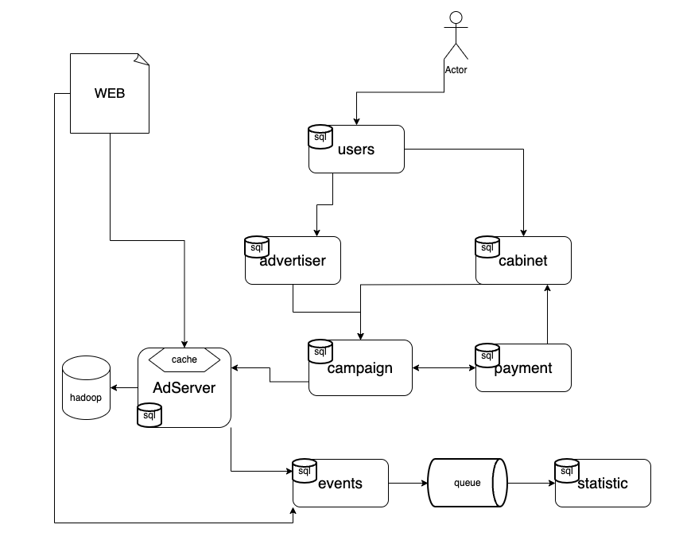

# Advertising
Система по створенню і обробці рекламних компаній як зі сторони рекламодавця так і зі сторони клієнтів

## Основні компоненти
* users - сервіси для реєструванню, авторизації, автентифікації користувачів сиситеми. 
* advertiser - сервіс по стоворенню і реєстрації нових компаній на рекламу зі сторони рекламодавця
* cabinet - сервіс по стоворенню і реєстрації нових компаній на рекламеу як зі сторони клієнта
* campaign - створення рекламних компаній, налаштування таргетенгу, повязання клієнта і рекламодавця 
* payments - payment система для отриманні платеж і розрахнків за рекламу
* adServer - після створення компаній і їх співпадіння рекламодавця з клієнтом. Створююється можливість показу за певним доступом, це може бути url
adServer відповідає за показ реклами і рекламного вмісту, спираючись на фільтри або ліміти рекламної компанії
* events - приймає і обробляє всі івенти системи і записує їх до черги
* statistic - читає з черги івенти статистики, обновляє і зберігає її до бази даних

## RPS 
Якщо банери будуть розміщені на top 10 сайтах в UK (по одному банеру на сторінку). 

Враховуючи населння UK ~67млн, з них відсоток який користується 
[інтернетом](https://uk.wikipedia.org/wiki/%D0%A1%D0%BF%D0%B8%D1%81%D0%BE%D0%BA_%D1%94%D0%B2%D1%80%D0%BE%D0%BF%D0%B5%D0%B9%D1%81%D1%8C%D0%BA%D0%B8%D1%85_%D0%BA%D1%80%D0%B0%D1%97%D0%BD_%D0%B7%D0%B0_%D0%BA%D1%96%D0%BB%D1%8C%D0%BA%D1%96%D1%81%D1%82%D1%8E_%D1%96%D0%BD%D1%82%D0%B5%D1%80%D0%BD%D0%B5%D1%82-%D0%BA%D0%BE%D1%80%D0%B8%D1%81%D1%82%D1%83%D0%B2%D0%B0%D1%87%D1%96%D0%B2) 
буде складати 95% на 2019р. тобто ~63млн. Візьмемо коефіцієнт 0.8 від тих хто користуєтсья інтернетом - це є потенційні відвідувачі сайтів.
На кожному сайті середня глибина переглядів 5 сторінок

RPS = 63млн * 0.8 * 10 * 5 / 86400 = ~29200 запитів на секунду 

## Система таргетингу
1. Демографія
2. Локація
3. Тематичний
4. Соціальний
5. Таргетинг по інтересах, звичках, повадках

## Основні технології
* Golang
* Postgres
* JS/React
* AWS/Bare-metal
* open telemetry, Prometheus, Jaeger, Grafana

## Відслідковування статистики
* По івентах відвідувачів сайтів
* По івентах сервісів
* Бізнес метрики сервісів

Зберігання статистики буде відбуватись в postgres базі даних, з розбиттям по днях, тижнях, місяцях, роках. З кожнеденним перехуванням з raw в stable статистику

## Total Cost of Ownership
* Витрати на інфрастуктуру ?
* Витарти на розробку ?